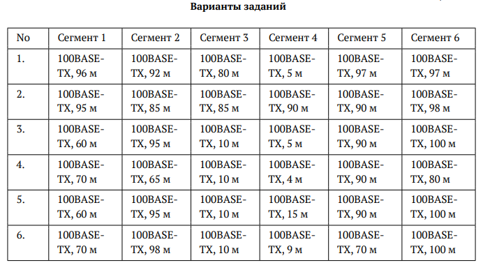
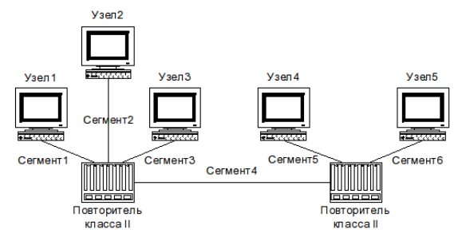

---
## Author
author:
  name: Гашимова Эсма Эльшан кызы
  email: 1132247520@rudn.ru
  affiliation:
    - name: Российский университет дружбы народов
      country: Российская Федерация
      postal-code: 117198
      city: Москва
      address: ул. Миклухо-Маклая, д. 6

## Title
title: Домашнее задание №2
subtitle:  Расчёт сети Fast Ethernet
license: CC BY
date: today
date-format: "YYYY-MM-DD"
---

# Цели и задачи работы

## Цель работы

Оценить работоспособность сети Fast Ethernet по первой и второй моделям расчета.

# Исходные данные

## Варианты заданий

{ #fig:001 width=85% height=85% }

## Топология сети

{ #fig:002 width=75% height=75% }

# Процесс выполнения работы

## Расчетные параметры

Все сегменты относятся к стандарту `100BASE-TX`.

В сети используются два повторителя класса II.

Предельно допустимый диаметр домена коллизий составляет 205 м.

Предельное время двойного оборота сигнала составляет 512 би.

# Результаты работы

## Работоспособные варианты

По результатам проверки требованиям обеих моделей соответствуют варианты 1, 3 и 4.

Для этих вариантов диаметр домена коллизий не превышает 205 м, а время двойного оборота сигнала не превышает 512 би.

## Неработоспособные варианты

Варианты 2, 5 и 6 не удовлетворяют требованиям Fast Ethernet.

В этих вариантах превышается допустимый диаметр домена коллизий и предельное время двойного оборота сигнала.

## Вывод

В ходе работы была выполнена проверка сети Fast Ethernet по первой и второй моделям.

Установлено, что варианты 1, 3 и 4 являются работоспособными.

Варианты 2, 5 и 6 неработоспособны, так как превышают допустимые ограничения Fast Ethernet.
