---
## Author
author:
  name: Гашимова Эсма Эльшан кызы
  email: 1132247520@rudn.ru
  affiliation:
    - name: Российский университет дружбы народов
      country: Российская Федерация
      postal-code: 117198
      city: Москва
      address: ул. Миклухо-Маклая, д. 6

## Title
title: Лабораторная работа №2
subtitle: Простые сети в GNS3. Анализ трафика
license: CC BY
date: today
date-format: "YYYY-MM-DD"
---

# Цели и задачи работы

## Цель лабораторной работы

Получение практических навыков моделирования простых компьютерных сетей в GNS3.

Изучение настройки IP-адресации узлов и маршрутизаторов.

Исследование сетевого трафика с использованием Wireshark.

# Сеть на базе Ethernet-коммутатора

## Создание топологии

В GNS3 создана сеть, состоящая из двух оконечных устройств VPCS и Ethernet-коммутатора.

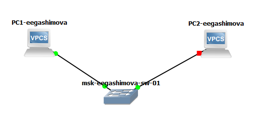{ #fig:001 width=75% height=70% }

## Команды VPCS

Для настройки и диагностики оконечных устройств использовался интерфейс командной строки VPCS.

{ #fig:002 width=75% height=70% }

## Настройка PC1

Узлу `PC1-eegashimova` назначен IP-адрес `192.168.1.11/24`.

В качестве шлюза указан адрес `192.168.1.1`.

{ #fig:003 width=70% height=65% }

## Настройка PC2 и проверка связи

Узлу `PC2-eegashimova` назначен IP-адрес `192.168.1.12/24`.

Связь между узлами проверена командой `ping`.

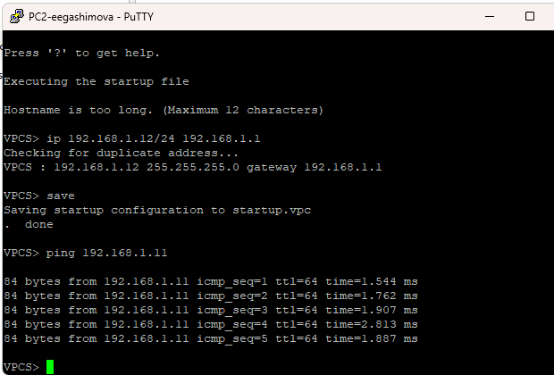{ #fig:004 width=70% height=65% }

# Анализ трафика в Wireshark

## Захват сетевого трафика

На соединении между `PC1-eegashimova` и Ethernet-коммутатором включён захват пакетов.

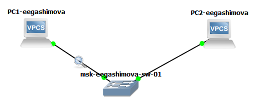{ #fig:005 width=75% height=65% }

## Анализ ARP

В Wireshark зафиксированы ARP-сообщения.

Gratuitous ARP используется узлом для объявления собственного IP-адреса и обнаружения возможного конфликта адресов.

{ #fig:006 width=90% height=65% }

## Проверка различных режимов ping

В VPCS выполнена проверка соединения в трёх режимах:

- ICMP;
- UDP;
- TCP.

Во всех случаях удалённый узел успешно отвечает.

{ #fig:007 width=70% height=65% }

## Анализ ICMP

При стандартной проверке `ping` передаются сообщения `ICMP Echo Request` и `ICMP Echo Reply`.

Наличие ответного пакета подтверждает доступность удалённого узла.

{ #fig:008 width=90% height=65% }

## Анализ UDP

При проверке в UDP-режиме между узлами передаются UDP-дейтаграммы.

UDP не требует предварительного установления соединения между устройствами.

{ #fig:009 width=90% height=65% }

## Анализ TCP

При проверке в TCP-режиме перед передачей данных выполняется установка соединения:

`SYN` → `SYN, ACK` → `ACK`.

После передачи данных соединение завершается с использованием флагов `FIN` и `ACK`.

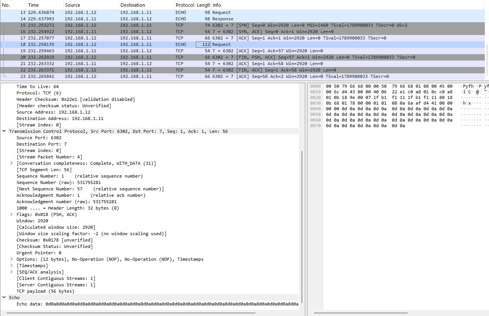{ #fig:010 width=90% height=65% }

# Сеть на базе маршрутизатора FRR

## Топология с FRR

В GNS3 создана сеть, состоящая из VPCS, Ethernet-коммутатора и маршрутизатора FRR.

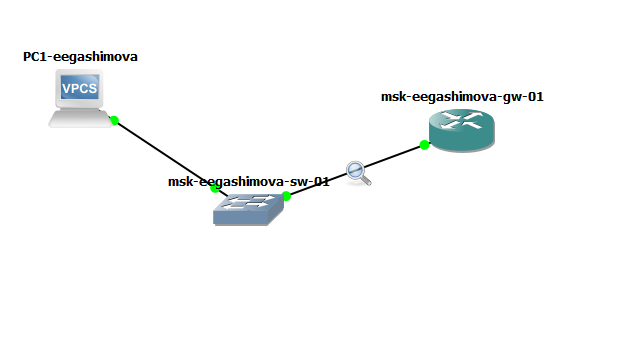{ #fig:011 width=75% height=65% }

## Настройка оконечного устройства

Узлу `PC1-eegashimova` назначен адрес:

`192.168.1.10/24`

В качестве шлюза указан маршрутизатор:

`192.168.1.1`

{ #fig:012 width=70% height=65% }

## Настройка маршрутизатора FRR

Маршрутизатору присвоено имя `msk-eegashimova-gw-01`.

Интерфейсу `eth0` назначен адрес `192.168.1.1/24`.

{ #fig:013 width=70% height=65% }

## Проверка конфигурации FRR

Для проверки настроек использованы команды:

`show running-config`

`show interface brief`

Интерфейс `eth0` находится в состоянии `up`.

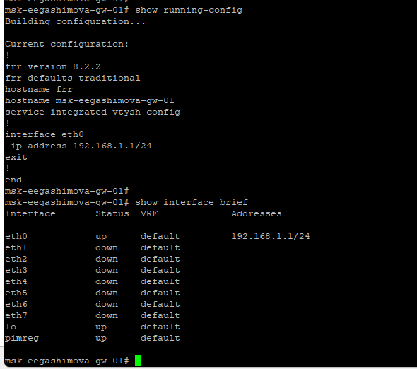{ #fig:014 width=70% height=65% }

## Проверка связи с FRR

С узла `PC1-eegashimova` выполнена команда:

`ping 192.168.1.1`

Получены ответы от маршрутизатора без потери пакетов.

{ #fig:015 width=70% height=65% }

## Анализ трафика FRR

Перед передачей ICMP-пакетов выполняется ARP-разрешение IP-адреса маршрутизатора.

После этого между `192.168.1.10` и `192.168.1.1` передаются сообщения `Echo Request` и `Echo Reply`.

{ #fig:016 width=90% height=65% }

# Сеть на базе маршрутизатора VyOS

## Топология с VyOS

Создана сеть, состоящая из VPCS, Ethernet-коммутатора и маршрутизатора VyOS.

{ #fig:017 width=75% height=65% }

## Настройка оконечного устройства

Узлу `PC1-eegashimova` назначен адрес `192.168.1.10/24`.

Шлюзом по умолчанию является адрес `192.168.1.1`.

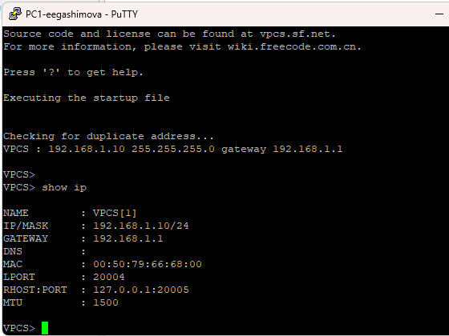{ #fig:018 width=70% height=65% }

## Настройка маршрутизатора VyOS

Для интерфейса `eth0` удалено получение IP-адреса по DHCP.

Интерфейсу назначен статический адрес `192.168.1.1/24`.

Конфигурация применена и сохранена.

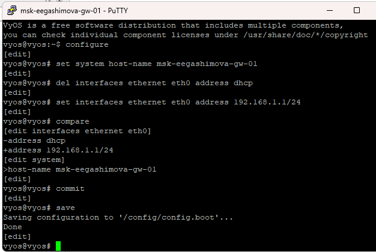{ #fig:019 width=75% height=65% }

## Проверка интерфейсов VyOS

Командой `show interfaces` проверено состояние сетевых интерфейсов маршрутизатора.

Интерфейс `eth0` имеет адрес `192.168.1.1/24`.

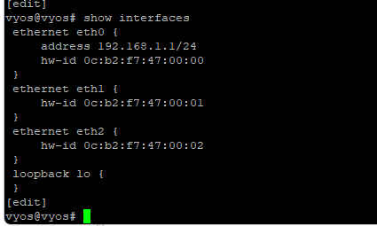{ #fig:020 width=65% height=65% }

## Проверка связи с VyOS

С узла `PC1-eegashimova` выполнена проверка доступности маршрутизатора.

Все ICMP-запросы получили ответы.

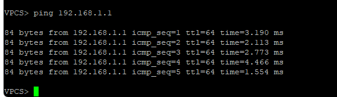{ #fig:021 width=70% height=65% }

## Анализ трафика VyOS

В Wireshark зафиксирован ARP-обмен между компьютером и маршрутизатором.

После определения MAC-адресов выполняется обмен сообщениями `ICMP Echo Request` и `ICMP Echo Reply`.

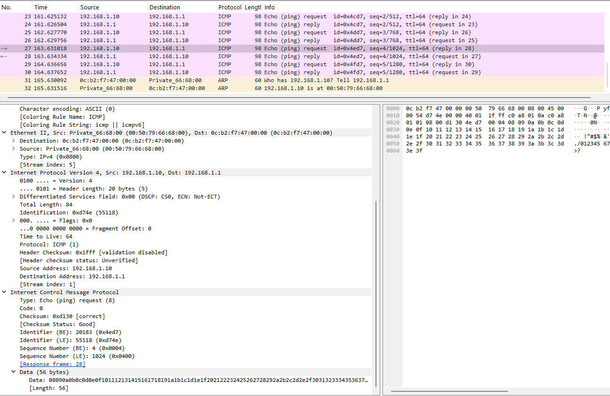{ #fig:022 width=90% height=65% }

# Результаты работы

## Выполненные действия

В GNS3 построена простая локальная сеть на базе Ethernet-коммутатора и двух VPCS.

Настроена IP-адресация оконечных устройств и проверена связь между ними.

С помощью Wireshark проанализированы протоколы ARP и ICMP, а также работа проверки соединения в UDP- и TCP-режимах.

Построены и настроены сети с маршрутизаторами FRR и VyOS.

## Полученные результаты

Для VPCS настроены адреса сети `192.168.1.0/24`.

Для маршрутизаторов FRR и VyOS настроен адрес `192.168.1.1/24`.

Работоспособность построенных топологий подтверждена успешным выполнением команды `ping`.

В Wireshark зафиксированы ARP-, ICMP-, UDP- и TCP-пакеты.

## Вывод

В результате выполнения лабораторной работы получены практические навыки создания и настройки сетевых топологий в GNS3.

Освоена настройка IP-адресации VPCS, маршрутизаторов FRR и VyOS.

Изучены механизмы работы протокола ARP и передачи ICMP-, UDP- и TCP-пакетов.

Анализ трафика в Wireshark подтвердил корректную работу созданных сетей и настроенных устройств.