---
## Author
author:
  name: Гашимова Эсма Эльшан кызы
  email: 1132247520@rudn.ru
  affiliation:
    - name: Российский университет дружбы народов
      country: Российская Федерация
      postal-code: 117198
      city: Москва
      address: ул. Миклухо-Маклая, д. 6

## Title
title: "Отчёт по лабораторной работе №2"
subtitle: "Простые сети в GNS3. Анализ трафика"
license: "CC BY"
---

# Цель работы

Построение простейших моделей сети на базе коммутатора и маршрутизаторов FRR и VyOS в GNS3, анализ трафика посредством Wireshark.

# Выполнение лабораторной работы

## Моделирование простейшей сети на базе коммутатора в GNS3

Создаю новый проект в GNS3 и размещаю в рабочей области коммутатор Ethernet и два оконечных устройства VPCS. В соответствии с требованиями работы изменяю имена устройств, используя имя учётной записи `eegashimova`: компьютерам присваиваю имена `PC1-eegashimova` и `PC2-eegashimova`, а коммутатору — `msk-eegashimova-sw-01`. Соединяю оба VPCS с Ethernet-коммутатором (см. рис. [@fig-001]).

{ #fig-001 width=70% }

Запускаю первый VPCS и открываю его консоль. Для ознакомления с доступными командами вызываю встроенную справку. В ней представлены команды настройки IP-адресации, просмотра состояния устройства, сохранения конфигурации, проверки сетевой доступности и другие команды VPCS (см. рис. [@fig-002]).

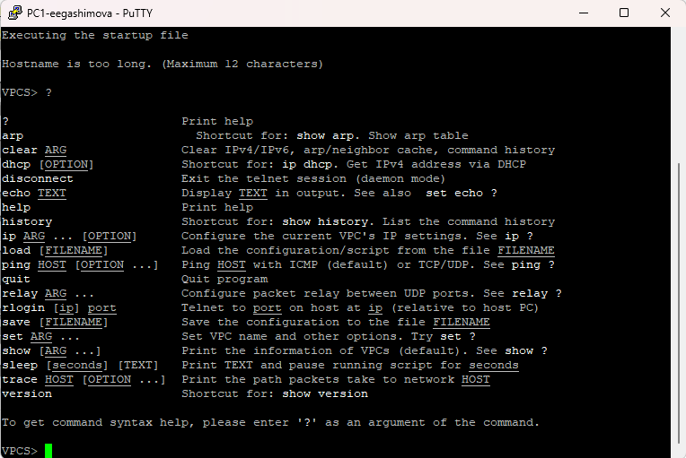{ #fig-002 width=75% }

Для узла `PC1-eegashimova` задаю IP-адрес `192.168.1.11/24` и адрес шлюза `192.168.1.1`:

```text
ip 192.168.1.11/24 192.168.1.1
save
```

После выполнения команды `ip` VPCS проверяет отсутствие дублирования адреса и применяет заданные параметры. Командой `save` сохраняю конфигурацию в файл запуска `startup.vpc` (см. рис. [@fig-003]).

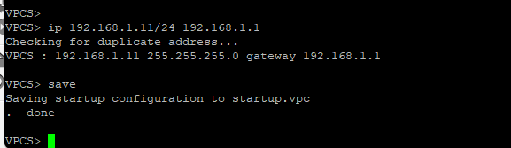{ #fig-003 width=70% }

Аналогично настраиваю узел `PC2-eegashimova`, назначая ему адрес `192.168.1.12/24` и шлюз `192.168.1.1`. После сохранения конфигурации проверяю доступность первого компьютера командой `ping 192.168.1.11`. Получаю ответы на все отправленные ICMP Echo Request, что подтверждает наличие сетевой связности между двумя оконечными устройствами через Ethernet-коммутатор (см. рис. [@fig-004]).

{ #fig-004 width=70% }

## Анализ трафика в GNS3 посредством Wireshark

Для анализа сетевого обмена включаю захват трафика на соединении между `PC1-eegashimova` и коммутатором `msk-eegashimova-sw-01`. После запуска всех устройств рядом с анализируемым соединением в GNS3 отображается значок захвата пакетов (см. рис. [@fig-005]).

{ #fig-005 width=70% }

После запуска узлов в Wireshark фиксируются служебные ARP-сообщения. В частности, устройства отправляют Gratuitous ARP Request для собственных адресов `192.168.1.11` и `192.168.1.12`. На выбранном кадре видно, что узел с MAC-адресом `00:50:79:66:68:01` сообщает об использовании адреса `192.168.1.12`. Ethernet-кадр направляется на широковещательный адрес `ff:ff:ff:ff:ff:ff`, а IP-адрес отправителя и проверяемый IP-адрес совпадают (см. рис. [@fig-006]).

Gratuitous ARP применяется для объявления собственного соответствия IP- и MAC-адресов, обновления ARP-таблиц других устройств и обнаружения возможного конфликта IP-адресов. Передача производится широковещательно, поскольку сообщение должно быть доступно всем узлам локального сегмента.

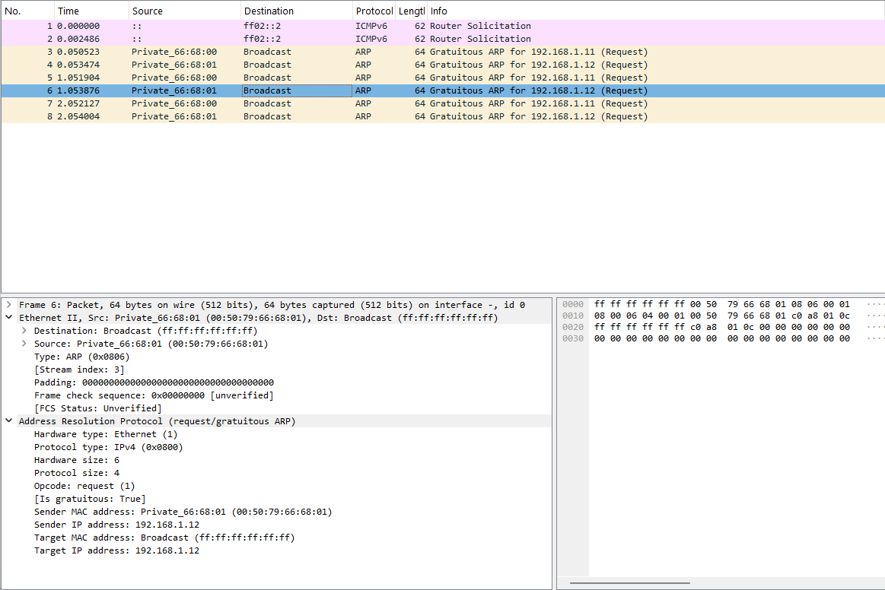{ #fig-006 width=95% }

В консоли `PC2-eegashimova` просматриваю параметры команды `ping`. VPCS позволяет выполнять проверку в нескольких режимах: стандартном ICMP, UDP и TCP. Для проверки каждого режима отправляю по одному запросу к узлу `192.168.1.11`:

```text
ping 192.168.1.11 -c 1 -1
ping 192.168.1.11 -c 1 -2
ping 192.168.1.11 -c 1 -3
```

Во всех трёх случаях получаю ответ от `PC1-eegashimova`, следовательно, соединение между узлами работает при использовании каждого из предусмотренных режимов проверки (см. рис. [@fig-007]).

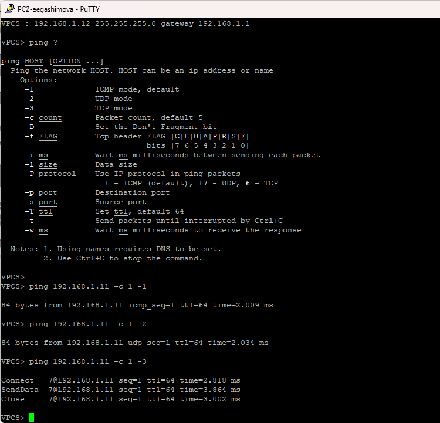{ #fig-007 width=70% }

При стандартном ICMP-режиме Wireshark фиксирует пару пакетов: `Echo (ping) request` от `192.168.1.12` к `192.168.1.11` и `Echo (ping) reply` в обратном направлении. В заголовке IPv4 исходным адресом является `192.168.1.12`, адресом назначения — `192.168.1.11`, значение TTL равно `64`, а поле Protocol содержит значение `ICMP (1)`.

В заголовке ICMP запрос имеет тип `8`, соответствующий Echo Request, а ответ — тип `0`, соответствующий Echo Reply. Наличие связанной пары запроса и ответа подтверждает успешную проверку доступности узла `PC1-eegashimova` (см. рис. [@fig-008]).

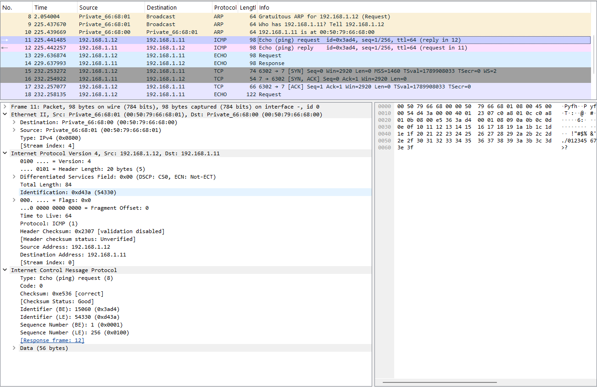{ #fig-008 width=95% }

При выполнении проверки в UDP-режиме VPCS формирует UDP-дейтаграмму с тестовыми данными. В захваченном обмене Wireshark определяет пакеты как Echo Request и Echo Response. Для ответного пакета на рисунке видны исходный адрес `192.168.1.11`, адрес назначения `192.168.1.12`, протокол UDP и полезная нагрузка Echo. В качестве одного из портов используется стандартный порт Echo `7` (см. рис. [@fig-009]).

В отличие от ICMP, UDP не устанавливает логическое соединение перед передачей данных. VPCS отправляет тестовую UDP-дейтаграмму, после чего по полученному ответу определяет доступность удалённого узла.

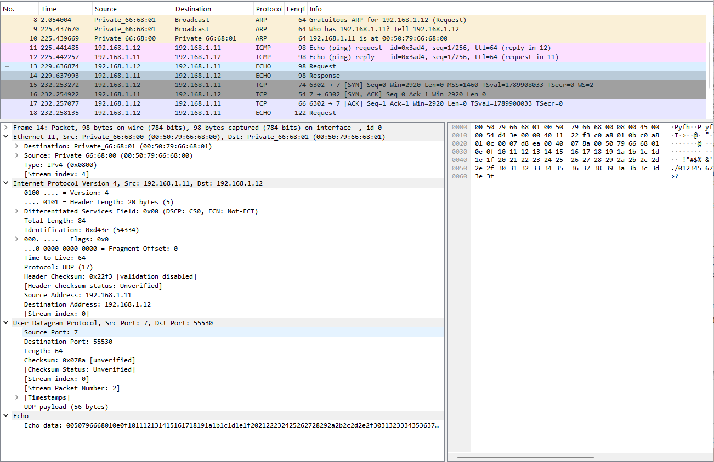{ #fig-009 width=95% }

При использовании TCP-режима процесс обмена сложнее. Перед передачей тестовых данных устанавливается TCP-соединение. В захвате присутствуют пакеты `SYN`, `SYN, ACK` и `ACK`, образующие стандартное трёхэтапное установление TCP-соединения. После этого передаётся Echo Request с полезной нагрузкой. Затем выполняется подтверждение данных и завершение соединения с использованием флагов `FIN` и `ACK` (см. рис. [@fig-010]).

На выбранном пакете видны TCP-порты, номера последовательности и подтверждения, а также полезная нагрузка. Проверка TCP подтверждает не только IP-доступность узла, но и возможность установить транспортное соединение с использованием TCP.

{ #fig-010 width=95% }

После завершения анализа останавливаю захват пакетов и работу устройств проекта.

## Моделирование простейшей сети на базе маршрутизатора FRR

Создаю топологию, состоящую из VPCS, Ethernet-коммутатора и маршрутизатора FRR. Устройства именую `PC1-eegashimova`, `msk-eegashimova-sw-01` и `msk-eegashimova-gw-01`. Узел VPCS соединяю с коммутатором, а коммутатор — с интерфейсом маршрутизатора. На соединении между коммутатором и FRR включаю захват трафика Wireshark (см. рис. [@fig-011]).

{ #fig-011 width=75% }

На узле `PC1-eegashimova` настраиваю IP-адрес `192.168.1.10/24` и шлюз по умолчанию `192.168.1.1`. Сохраняю конфигурацию и выполняю команду `show ip`. Вывод подтверждает, что IP-адрес и адрес шлюза установлены корректно (см. рис. [@fig-012]).

```text
ip 192.168.1.10/24 192.168.1.1
save
show ip
```

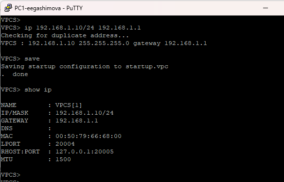{ #fig-012 width=70% }

Перехожу к настройке маршрутизатора FRR. В интерфейсе `vtysh` вхожу в режим конфигурирования, устанавливаю имя маршрутизатора `msk-eegashimova-gw-01` и сохраняю конфигурацию. После этого перехожу к настройке интерфейса `eth0`, назначаю ему IP-адрес `192.168.1.1/24` и включаю интерфейс командой `no shutdown`:

```text
configure terminal
hostname msk-eegashimova-gw-01
exit
write memory

configure terminal
interface eth0
ip address 192.168.1.1/24
no shutdown
exit
exit
write memory
```

FRR сообщает об успешном сохранении интегрированной конфигурации в `/etc/frr/frr.conf` (см. рис. [@fig-013]).

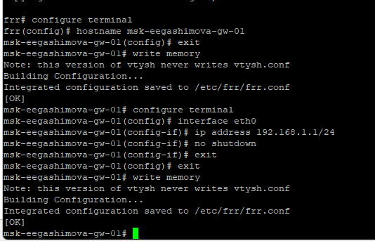{ #fig-013 width=70% }

Для проверки конфигурации выполняю команды:

```text
show running-config
show interface brief
```

В текущей конфигурации присутствует имя `msk-eegashimova-gw-01`, а для интерфейса `eth0` указан адрес `192.168.1.1/24`. В выводе `show interface brief` интерфейс `eth0` имеет состояние `up`, что подтверждает его работоспособность. Остальные Ethernet-интерфейсы, которые не используются в созданной топологии, находятся в состоянии `down` (см. рис. [@fig-014]).

{ #fig-014 width=70% }

С узла `PC1-eegashimova` выполняю проверку доступности адреса маршрутизатора:

```text
ping 192.168.1.1
```

Маршрутизатор успешно отвечает на все пять ICMP Echo Request. Потерь пакетов не наблюдается, а значения времени ответа составляют несколько миллисекунд, что подтверждает корректность настройки локальной сети и интерфейса FRR (см. рис. [@fig-015]).

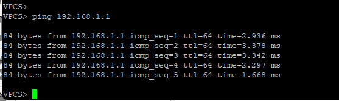{ #fig-015 width=70% }

В Wireshark анализирую трафик на соединении между коммутатором и маршрутизатором. Перед ICMP-обменом наблюдается ARP-разрешение адреса: для IP-адреса `192.168.1.1` определяется MAC-адрес интерфейса маршрутизатора.

После получения необходимой информации начинается последовательный обмен ICMP Echo Request и Echo Reply между адресами `192.168.1.10` и `192.168.1.1`. На выбранном кадре видно, что запрос отправляется с `192.168.1.10` на `192.168.1.1`, используется протокол ICMP, TTL равен `64`, а ICMP-сообщение имеет тип `8`, то есть Echo Request. Для каждого запроса в захвате присутствует соответствующий Echo Reply от маршрутизатора (см. рис. [@fig-016]).

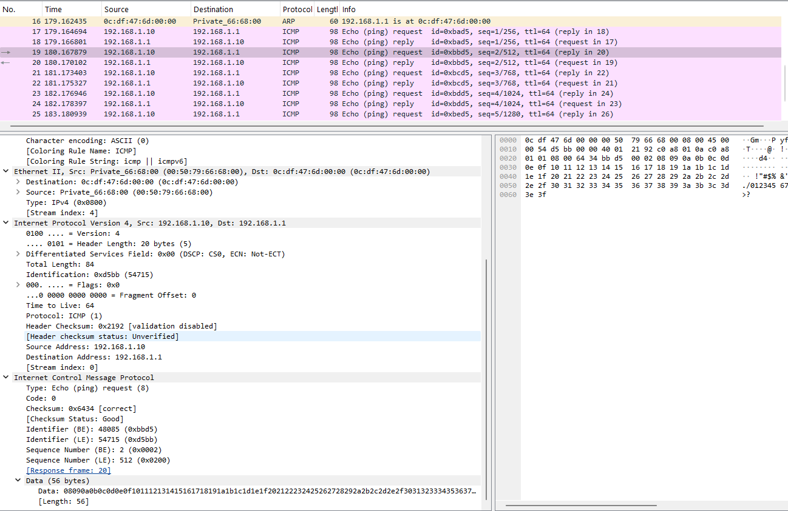{ #fig-016 width=95% }

После проверки останавливаю захват трафика и завершаю работу устройств данного проекта.

## Моделирование простейшей сети на базе маршрутизатора VyOS

Создаю топологию с маршрутизатором VyOS, Ethernet-коммутатором и одним VPCS. Использую имена `PC1-eegashimova`, `msk-eegashimova-sw-01` и `msk-eegashimova-gw-01`. Между коммутатором и маршрутизатором включаю захват трафика для последующего анализа в Wireshark (см. рис. [@fig-017]).

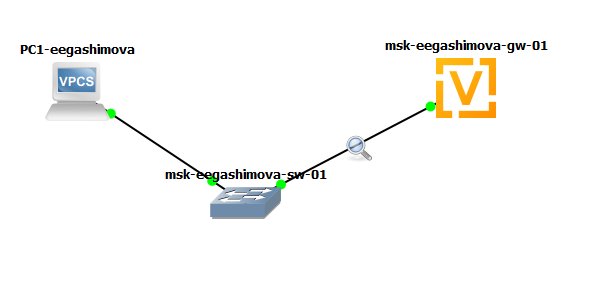{ #fig-017 width=75% }

Для `PC1-eegashimova` задаю адрес `192.168.1.10/24` и шлюз `192.168.1.1`. После сохранения параметров проверяю конфигурацию командой `show ip`. В выводе отображаются требуемые IP-адрес и шлюз (см. рис. [@fig-018]).

```text
ip 192.168.1.10/24 192.168.1.1
save
show ip
```

{ #fig-018 width=70% }

После загрузки VyOS авторизуюсь под учётной записью `vyos` и перехожу в режим конфигурирования. Устанавливаю имя маршрутизатора, удаляю получение адреса для `eth0` по DHCP и назначаю статический адрес `192.168.1.1/24`:

```text
configure
set system host-name msk-eegashimova-gw-01
del interfaces ethernet eth0 address dhcp
set interfaces ethernet eth0 address 192.168.1.1/24
compare
commit
save
```

Команда `compare` показывает удаление параметра `address dhcp`, добавление адреса `192.168.1.1/24` для `eth0` и изменение имени устройства. Командой `commit` применяю конфигурацию, а `save` сохраняет её в `/config/config.boot` (см. рис. [@fig-019]).

{ #fig-019 width=75% }

Для проверки настроек выполняю команду `show interfaces`. В конфигурации интерфейса `eth0` отображается назначенный адрес `192.168.1.1/24`. Также присутствуют интерфейсы `eth1`, `eth2` и loopback-интерфейс `lo`, однако для подключения локальной сети используется `eth0` (см. рис. [@fig-020]).

{ #fig-020 width=65% }

С компьютера `PC1-eegashimova` проверяю доступность интерфейса маршрутизатора командой:

```text
ping 192.168.1.1
```

Получаю пять ответов от `192.168.1.1` с TTL `64`. Все ICMP-запросы успешно получают ответы, следовательно, IP-адресация на VPCS и VyOS настроена корректно, а соединение через Ethernet-коммутатор функционирует (см. рис. [@fig-021]).

{ #fig-021 width=70% }

В Wireshark наблюдаю ICMP Echo Request от `192.168.1.10` к `192.168.1.1` и соответствующие Echo Reply в обратном направлении. Для выбранного запроса в IPv4-заголовке указаны исходный адрес `192.168.1.10`, адрес назначения `192.168.1.1`, TTL `64` и протокол ICMP. В заголовке ICMP установлен тип `8`, соответствующий Echo Request.

Кроме ICMP-пакетов, в захвате присутствует ARP-обмен. Маршрутизатор с адресом `192.168.1.1` отправляет запрос `Who has 192.168.1.10?`, после чего получает ARP Reply с MAC-адресом узла `192.168.1.10`. ARP необходим маршрутизатору для определения MAC-адреса получателя перед отправкой Ethernet-кадра в пределах локальной сети (см. рис. [@fig-022]).

{ #fig-022 width=95% }

После завершения проверки останавливаю захват пакетов в Wireshark, останавливаю все устройства проекта и завершаю работу с GNS3.

# Вывод

В ходе лабораторной работы построены и проверены несколько простых сетевых топологий в GNS3. Сначала настроена локальная сеть из двух VPCS, соединённых через Ethernet-коммутатор. Узлам назначены адреса `192.168.1.11/24` и `192.168.1.12/24`, после чего успешный обмен ICMP-пакетами подтвердил наличие связи.

С помощью Wireshark исследована работа протокола ARP, включая Gratuitous ARP, а также проанализированы проверки доступности в ICMP-, UDP- и TCP-режимах. ICMP использует сообщения Echo Request и Echo Reply, UDP передаёт тестовые дейтаграммы без предварительного установления соединения, а TCP перед передачей данных выполняет установление соединения с использованием последовательности `SYN` — `SYN, ACK` — `ACK`.

Далее построены сети с маршрутизаторами FRR и VyOS. В обоих случаях узлу VPCS назначен адрес `192.168.1.10/24`, а интерфейсу маршрутизатора — `192.168.1.1/24`. Проверка командой `ping` показала успешную передачу данных между оконечным устройством и маршрутизатором. Анализ захваченного трафика подтвердил выполнение ARP-разрешения адресов и последующий двусторонний обмен ICMP Echo Request и Echo Reply.
